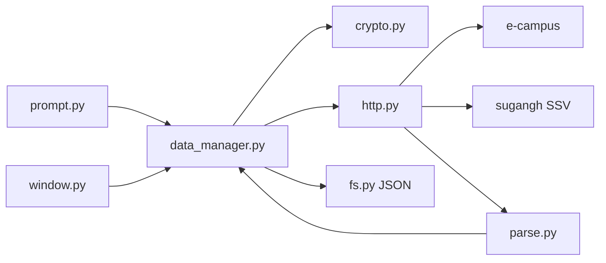

# seowon-cli

<p align="center">
  <strong>서원대학교 e-campus 과제 · 이러닝을 터미널과 창에서 조회하는 Python 클라이언트</strong>
</p>

<p align="center">
  로그인 한 번으로 <b>지금 할 과제</b>와 <b>들어야 할 이러닝</b>을 표로 봅니다.
</p>

<p align="center">
  
  
  
  
  
  
</p>

<p align="center">
  <a href="https://github.com/hy040504/seowon-cli">hy040504/seowon-cli</a>
</p>

공식 SDK가 아닙니다. 수업용 **조회 전용** 도구입니다.  
과제 제출, 이러닝 자동 시청, 출석 처리, 수강신청은 넣지 않습니다.

브라우저로 여러 학생이 쓰려면 별도 저장소 [seowon-client-web](https://github.com/hy040504/seowon-client-web) 을 켭니다.

```text
============================================
  서원대 e-campus 과제·이러닝 현황   v1.0.0
  조회 전용 · Python · JSON 저장
============================================
[100.0%] Loading... *

  메인 메뉴
  [로그인됨: 홍길동 (20241234) · 컴퓨터공학과]
  1. 로그인 / 세션
  2. 과제 확인
  3. 이러닝 확인
  4. 현황 한 표 요약
  5. 파일 / 설정
  0. 종료
```

---

## 이 저장소에 있는 것

| | TUI | GUI |
| --- | :---: | :---: |
| 실행 | `python seowon_tui.py` | `python seowon_gui.py` |
| 과제 · 이러닝 조회 | O | O |
| 현황 한 표 | O | O |
| 오프라인 데모 | `--demo` | `--demo` |
| 과제 제출 · 자료 받기 | — | — |

---

## 왜 쓰나

e-campus는 과목마다 강의실을 들어가야 과제·출결을 볼 수 있습니다.  
이 프로그램은 로그인 한 번으로 전 과목을 모아 **지금 할 일**만 보여 줍니다.

| 보고 싶은 것 | TUI 메뉴 |
| --- | --- |
| 기간 안 미제출 과제 | `2` → `2` |
| 미제출·진행중 전수 | `2` → `3` |
| 들을 이러닝 차시 | `3` → `2` |
| 과목별 미제출 + 미완료 | `4` |
| 고른 차시 학습률(%) | `3` → `3` |

학습률은 차시 목록에 없습니다. **고른 차시만** 한 번 더 조회합니다. 시청 기록은 보내지 않습니다.

학번·비밀번호를 `login.json` 에 둘 다 채워 두면 입력을 건너뜁니다. 하나라도 비어 있으면 직접 입력합니다.  
`session.json` / `result.json` / `config.json` 에는 비밀번호를 넣지 않습니다.

---

## 빠른 시작

### 필요 환경

| 항목 | 내용 |
| --- | --- |
| OS | Windows 10+ (HTTPS 조회는 다른 OS 에서도 동작) |
| Python | 3.10 이상 |
| GUI | PyQt6 (`pip install -r requirements.txt`) |
| 저장 | JSON만 (`config.json`, `login.json`, `session.json`, `result.json`) |

```bat
pip install -r requirements.txt
python seowon_tui.py --test
```

```bat
python seowon_tui.py              터미널 메뉴 (실제 e-campus)
python seowon_tui.py --demo       testdata 로 오프라인 시연
python seowon_tui.py --test       파서 · 필터 · 암호 단위 테스트
python seowon_gui.py              PyQt 창
python seowon_gui.py --demo       GUI 를 데모 체크로 시작
python lib\front\gui\main.py      GUI 직접 실행
build.bat test                    위와 같은 단위 테스트
```

TUI와 GUI는 **같은 Python 조회 엔진** (`lib/back`) 을 씁니다. 컴파일러나 실행 파일은 필요 없습니다.

---

## TUI 메뉴

계층 메뉴입니다. `z` / `0` 은 뒤로, `q` 는 종료입니다.  
기능표 번호(`1.1.1` 같은 것)는 메뉴에 적지 않습니다.

```text
메인
├─ 1  로그인 / 세션          login.json 또는 직접 입력, session.json 쿠키 재사용
├─ 2  과제 확인
│   ├─ 1  전체 과제
│   ├─ 2  현재 수행 가능 (기간 안 + 미제출)
│   ├─ 3  미제출 전수 조사
│   └─ 4  과제 상세
├─ 3  이러닝 확인
│   ├─ 1  차시 목록 · 출결
│   ├─ 2  들을 차시
│   └─ 3  학습률(%) — 조회만, 시청 기록 없음
├─ 4  현황 한 표             과목별 미제출 / 미완료
└─ 5  파일 / 설정
    ├─ 1  config.json · login.json 상태
    ├─ 2  result.json 저장
    └─ 3  result.json 불러오기
```

시작 화면과 메뉴 전환에는 [SeowonProject](https://github.com/hy040504/SeowonProject) 의 `LoadSpin` 을 응용한 로딩 효과가 있습니다.

비밀번호는 `*` 로 가리고, **마지막으로 친 글자만** 잠깐 보입니다.

로그인에 성공하면 이름·학번·학과를 보여 줍니다. 예: `홍길동 (20241234) · 컴퓨터공학과`  
e-campus 로그인 JSON에는 이름·학과가 없어서, 수강신청 SSO(`sugangh`)에서 한 번 더 가져옵니다.

---

## GUI

`lib/front/gui` 의 PyQt6 화면입니다. 색·카드·사이드바는 [seowon-client-web](https://github.com/hy040504/seowon-client-web) 과 같은 토스 톤입니다. 웹에 있는 제출·자료·시간표·성적은 넣지 않습니다.

- 왼쪽 내비는 64px 이모지 바. 마우스를 올리면 236px 로 펼쳐지고 `서원대 몰아보기` · `Ver. 1.0.0` · `조회 전용` 이 보입니다
- 메뉴: 로그인, 지금 할 것, 과제, 이러닝, 현황, 설정, 정보
- 과제·이러닝·지금 할 것은 표 대신 웹과 같은 카드 목록(제목·기간·상태 알약)
- 로그인에 성공하면 알림창 대신 초록 Successful! 카드. 다음은 `지금 할 것`
- 오류·안내는 위쪽 토스트. 로그인·조회 중에는 웹과 같은 스피너 + 알약 메시지
- 로그인 칸은 `login.json` 을 미리 채움. 학번·비밀번호가 둘 다 있으면 입력 없이 로그인
- 데모 모드 칸은 파란 네모 안 V자 체크. 설정에서 라이트/다크
- 조회는 같은 프로세스의 `lib.back.App` 을 백그라운드 스레드에서 호출합니다. 별도 실행 파일은 띄우지 않습니다.

---

## 관련 저장소

| 저장소 | 역할 |
| --- | --- |
| [seowon-cli](https://github.com/hy040504/seowon-cli) | 이 저장소. Python TUI·GUI, 조회만 |
| [seowon-client-web](https://github.com/hy040504/seowon-client-web) | 브라우저 웹. 여러 학생, 제출·받기·시간표·성적 |
| [seowon-client-api](https://github.com/hy040504/seowon-client-api) | TypeScript 조회 엔진. 웹이 사용 |

---

## 구조

저장소 루트가 작업 폴더입니다. `lib/front` · `lib/back` 배치는 [SeowonProject](https://github.com/hy040504/SeowonProject/tree/master/project) 를 따릅니다.

```text
seowon-cli
├─ seowon_tui.py          TUI 진입점
├─ seowon_gui.py          GUI 진입점
├─ build.bat              TUI / GUI / 테스트 실행 도우미
├─ lib
│  ├─ seowon.py           상수 · 자료 구조
│  ├─ util.py             문자열 · 기간 · 콘솔
│  ├─ test_runner.py      단위 테스트
│  ├─ front
│  │  ├─ tui              터미널 UI
│  │  │  ├─ ui.py
│  │  │  └─ prompt.py
│  │  └─ gui              PyQt 화면
│  │     ├─ main.py
│  │     ├─ window.py
│  │     ├─ style.py
│  │     ├─ widgets.py
│  │     ├─ backend.py
│  │     └─ assets/loading_e1.png
│  └─ back                조회 · 파일 · 패킷
│     ├─ http / crypto / parse / fs
│     ├─ data_manager
│     └─ ssv / sugang     이름·학과 (수강신청 SSO)
├─ db/testdata            데모·테스트용 HTML/JSON (세션 파일 아님)
├─ login.json.example     학번·비밀번호 빈 칸 예제
├─ requirements.txt       PyQt6
└─ README.md
```



---

## 저장 파일

`config.json` · `login.json` 은 실행 폴더, 세션·결과는 `dataDir`(기본 `./db`) 아래입니다.  
`./db` 가 없으면 실행할 때 만듭니다.  
저장소에는 **`db/testdata`만** 올립니다. `session.json` / `result.json` / `config.json` / `login.json` 은 `.gitignore` 입니다.

예제: [`config.json.example`](config.json.example), [`login.json.example`](login.json.example)

```json
{
  "lastStudentId": "20241234",
  "saveSession": true,
  "saveResult": true,
  "dataDir": "./db"
}
```

| 파일 | 내용 |
| --- | --- |
| `config.json` | 마지막 학번, 저장 옵션, 폴더 |
| `login.json` | 학번·비밀번호. 둘 다 있으면 로그인 입력 생략. **로컬 평문, git 제외** |
| `db/session.json` | 학번, 이름, 학과, 쿠키. **비밀번호 없음** |
| `db/result.json` | 최근 조회 결과. 오프라인에서 다시 그림 |
| `db/testdata/` | 데모·단위 테스트용 고정 응답 |

`login.json` 예제:

```json
{
  "studentId": "",
  "password": ""
}
```

학번이나 비밀번호 중 하나라도 비어 있으면 TUI·GUI 모두 지금처럼 직접 입력합니다.

`session.json` 필드:

```json
{
  "studentId": "20241234",
  "userNo": "20241234",
  "studentName": "홍길동",
  "deptName": "컴퓨터공학과",
  "deptCd": "320",
  "savedAt": "2026-08-16T12:00:00",
  "cookies": []
}
```

---

## 요청 흐름

[seowon-client-api](https://github.com/hy040504/seowon-client-api) 와 같은 조회 경로입니다.

1. `GET /home/mainPop/popup/login` — 세션 쿠키
2. NICE `encryptData` 를 `POST /user/userHome/login`
3. 이름·학과: `sugangh.seowon.ac.kr` 의 `findAppcsLogin` / `findStunoInfo` (SSV)
4. `POST /crs/creCrsHome/classRoomCrsCreList` — 과목
5. `POST /asmnt/asmntHome/stuAsmntGridList` — 과제
6. `POST /lesson/lessonLect/lessonList` — 이러닝 차시
7. (선택) `POST /asmnt/asmntLect/Form/asmntStuMain` — 과제 상세
8. (선택) `POST /lesson/lessonLect/viewLessonStudyDetail` — 학습률. **기록 전송 없음**

HTTP는 표준 라이브러리 `urllib`, JSON은 표준 라이브러리 `json` 입니다.  
로그인 암호는 `lib/back/crypto.py` 의 NICE DES (기존 C/JS 구현과 동일 벡터).

---

## 하지 않는 것

- 과제 제출, 파일 업로드
- 이러닝 자동 시청 · 출석 처리
- 수강신청 · 희망바구니
- 다른 학생 계정 조회
- `.dat` / `.txt` / SQLite
- C 소스 · 컴파일러 · `seowon-tui.exe` / `seowon-gui.exe`
- `session.json` · `result.json` · `config.json` 에 비밀번호 저장
- `login.json` 을 Git·원격에 올리기 (로컬 전용)

---

## 변경 사항

코드에 이미 들어가 있는 내용을 README에 한곳에 모아 둡니다.

### Python 이식

- TUI · 조회 엔진 · 단위 테스트 · GUI 가 모두 Python 3.10+.
- GUI는 `lib.back.App` 을 같은 프로세스에서 호출합니다.
- 실행: `python seowon_tui.py` / `python seowon_gui.py`. C 소스, `.exe`, npm lock 은 없습니다.
- JSON은 표준 라이브러리 `json`, HTTPS 는 `urllib`. 로그인 암호는 `crypto.py` 의 NICE DES.

### 화면 · 입력

- [SeowonProject](https://github.com/hy040504/SeowonProject) 처럼 `lib/front` · `lib/back` 으로 나누고, 주석은 한국어.
- 메뉴는 계층입니다. `z`/`0` 뒤로, `q` 종료.
- 비밀번호는 `*` 로 가리고, 마지막 글자만 잠깐 보여 줌.

### 로그인 후 이름 · 학번 · 학과

- e-campus 로그인만으로는 이름·학과가 안 나와서 `sugangh` SSO SSV(`findAppcsLogin`, `findStunoInfo`)를 씀.
- TUI·GUI 로그인 줄에 `이름 (학번) · 학과` 를 표시.
- `session.json` 에 `studentName`, `deptName`, `deptCd` 를 같이 저장. 비밀번호는 `session.json` 에 넣지 않음.
- 로그인 계정은 `login.json`. 학번·비밀번호가 둘 다 있으면 입력을 건너뛰고, 하나라도 비면 직접 입력.

### GUI

- `lib/front/gui` 에 PyQt6 화면. 색·카드·접히는 이모지 사이드바는 [seowon-client-web](https://github.com/hy040504/seowon-client-web) 을 따른다.
- 메뉴에 `지금 할 것`(기간 안 미제출+들을 차시)과 `프로그램 정보` 가 있다. 제출·공지·자료·시간표·성적은 없다.
- 과제·이러닝은 표 대신 카드 목록. 상태는 알약, 오류는 토스트.
- 로그인에 성공하면 알림창 대신 Successful! 카드로 바뀐다.
- 데모 모드 칸은 파란 네모 안 V자 체크.
- 로그인·조회 중에는 웹 `loading_e1` 스피너 오버레이.

### 웹 분리

- 브라우저 웹은 이 저장소에 두지 않는다. [seowon-client-web](https://github.com/hy040504/seowon-client-web) 을 본다.

---

## 라이선스

MIT. 수업용 **비공식** 클라이언트입니다.
