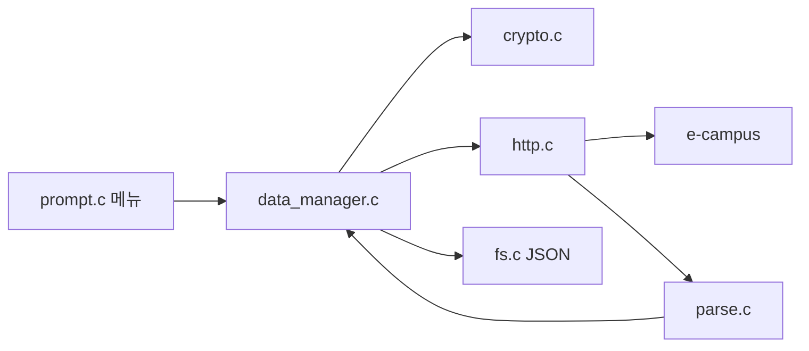

# seowon-cli

<p align="center">
  <strong>서원대학교 e-campus 과제 · 이러닝 현황을 터미널에서 한 번에 보는 C CLI</strong>
</p>

<p align="center">
  
  
  
  
  
</p>

한 번 로그인하면 과목마다 강의실을 열지 않고, **지금 할 과제**와 **들어야 할 이러닝**을 표로 봅니다.

공식 SDK가 아닙니다. **조회만** 합니다. 과제 제출, 이러닝 자동 시청, 수강신청은 넣지 않습니다.

```text
============================================
  서원대 e-campus 과제·이러닝 현황   v1.0.0
  조회 전용 · C언어 · JSON 저장
============================================
[100.0%] Loading... *

  메인 메뉴
  [로그인됨: 20241234]
  1. 로그인 / 세션
  2. 과제 확인
  3. 이러닝 확인
  4. 현황 한 표 요약
  5. 파일 / 설정
  0. 종료
```

---

## 왜 쓰나

e-campus는 과목마다 강의실을 들어가야 과제·출결을 볼 수 있습니다.  
이 프로그램은 로그인 한 번으로 전 과목을 모아 **지금 할 일**만 보여 줍니다.

| 보고 싶은 것 | 메뉴 |
| --- | --- |
| 기간 안 미제출 과제 | `2` → `2` |
| 미제출·진행중 전수 | `2` → `3` |
| 들을 이러닝 차시 | `3` → `2` |
| 과목별 미제출 + 미완료 한 표 | `4` |
| 고른 차시 학습률(%) | `3` → `3` |

학습률은 차시 목록에 없습니다. **고른 차시만** 한 번 더 조회합니다.  
비밀번호는 JSON에 넣지 않습니다.

---

## 메뉴

`switch` 계층 메뉴입니다. `z` / `0` 은 뒤로, `q` 는 종료입니다.

```text
메인
├─ 1  로그인 / 세션          학번·비밀번호, session.json 쿠키 재사용
├─ 2  과제 확인
│   ├─ 1  전체 과제
│   ├─ 2  현재 수행 가능 (기간 안 + 미제출)
│   ├─ 3  미제출 전수 조사
│   └─ 4  과제 상세
├─ 3  이러닝 확인
│   ├─ 1  차시 목록 · 출결
│   ├─ 2  들을 차시
│   └─ 3  학습률(%) — 조회만, 시청 기록 없음
├─ 4  현황 한 표             과목별 미제출 / 미완료
└─ 5  파일 / 설정
    ├─ 1  config.json
    ├─ 2  result.json 저장
    └─ 3  result.json 불러오기
```

시작 화면과 메뉴 전환에는 [SeowonProject](https://github.com/hy040504/SeowonProject) 의 `LoadSpin` 을 응용한 로딩 효과가 있습니다.

---

## 빠른 시작

### 필요 환경

| 항목 | 내용 |
| --- | --- |
| OS | Windows 10+ |
| 언어 | C11 |
| 편집기 | Visual Studio Code |
| 컴파일러 | MinGW-w64 / MSVC / TinyCC 중 하나 |
| 저장 | JSON만 (`config.json`, `session.json`, `result.json`) |

```bat
winget install BrechtSanders.WinLibs.POSIX.UCRT
```

### 빌드

이 폴더를 VS Code로 연 뒤 `Ctrl+Shift+B`, 또는:

```bat
build.bat
build.bat test
```

이 브랜치(`tui`)는 터미널 UI만 있습니다. PyQt GUI 는 `gui` 브랜치, 둘 다는 `main` 입니다.

### 실행

```bat
seowon-tui.exe              터미널 메뉴 (실제 e-campus)
seowon-tui.exe --demo       testdata 로 오프라인 시연
seowon-tui.exe --test       파서 · 필터 · 암호 단위 테스트
```

데모는 네트워크 없이 메뉴와 표를 보여 줄 때 씁니다.

---

## 구조

저장소 루트가 작업 폴더입니다. `lib/front` · `lib/back` 배치는 [SeowonProject](https://github.com/hy040504/SeowonProject/tree/master/project) 를 따릅니다.

모듈은 `.h` / `.c` 한 쌍입니다. **`.h`는 다른 파일이 불러도 되는 API(함수·상수·자료형)**, **`.c`는 그 구현**입니다. 파일 안에서만 쓰는 함수는 `.c`에 `static` 으로 둡니다.

화면은 `lib/front/tui` (C 터미널)입니다. 조회·로그인·JSON 은 `lib/back` 입니다.

```text
seowon-cli
├─ main.c                 TUI 진입점
├─ test.c
├─ lib
│  ├─ front/tui           C 터미널 UI
│  ├─ back                조회 · 파일 · 패킷
│  ├─ c_modules           외부 라이브러리 (cJSON, winhttp_min)
│  ├─ seowon.h
│  └─ util.c
├─ db/testdata
├─ build.bat
└─ README.md
```



---

## 저장 파일

`config.json` 은 실행 폴더, 세션·결과는 `dataDir`(기본 `./db`) 아래입니다.  
예제: [`config.json.example`](config.json.example)

```json
{
  "lastStudentId": "20241234",
  "saveSession": true,
  "saveResult": true,
  "dataDir": "./db"
}
```

| 파일 | 내용 |
| --- | --- |
| `config.json` | 마지막 학번, 저장 옵션, 폴더 |
| `db/session.json` | 학번 + 쿠키. **비밀번호 없음** |
| `db/result.json` | 최근 조회 결과. 오프라인에서 다시 그림 |

---

## 요청 흐름

[seowon-client-api](https://github.com/hy040504/seowon-client-api) 와 같은 조회 경로입니다.

1. `GET /home/mainPop/popup/login` — 세션 쿠키
2. NICE `encryptData` 를 `POST /user/userHome/login`
3. 이름·학과: `sugangh.seowon.ac.kr` 의 `findAppcsLogin` / `findStunoInfo` (SSV)
3. `POST /crs/creCrsHome/classRoomCrsCreList` — 과목
4. `POST /asmnt/asmntHome/stuAsmntGridList` — 과제
5. `POST /lesson/lessonLect/lessonList` — 이러닝 차시
6. (선택) `POST /asmnt/asmntLect/Form/asmntStuMain` — 과제 상세
7. (선택) `POST /lesson/lessonLect/viewLessonStudyDetail` — 학습률. **기록 전송 없음**

HTTP는 Windows **WinHTTP**, JSON은 `lib/c_modules` 의 [cJSON](https://github.com/DaveGamble/cJSON) 입니다.

## 외부 라이브러리 (`lib/c_modules`)

직접 짠 코드가 아니라 가져다 쓰는 소스입니다. `front` / `back` 과 구분해 둡니다.

| 파일 | 역할 |
| --- | --- |
| `cJSON.c` / `cJSON.h` | `config.json`, `session.json`, `result.json`, 로그인 JSON |
| `cJSON.LICENSE` | cJSON MIT 라이선스 |
| `winhttp_min.h` | TinyCC처럼 SDK `winhttp.h` 가 없을 때 쓰는 선언. 본체는 `winhttp.dll` |

---

## 하지 않는 것

- 과제 제출, 파일 업로드
- 이러닝 자동 시청 · 출석 처리
- 수강신청 · 희망바구니
- 다른 학생 계정 조회
- `.dat` / `.txt` / SQLite
- 비밀번호를 JSON에 저장

---

## 라이선스

MIT. 수업용 **비공식** 클라이언트입니다.  
cJSON 은 MIT 라이선스입니다.
