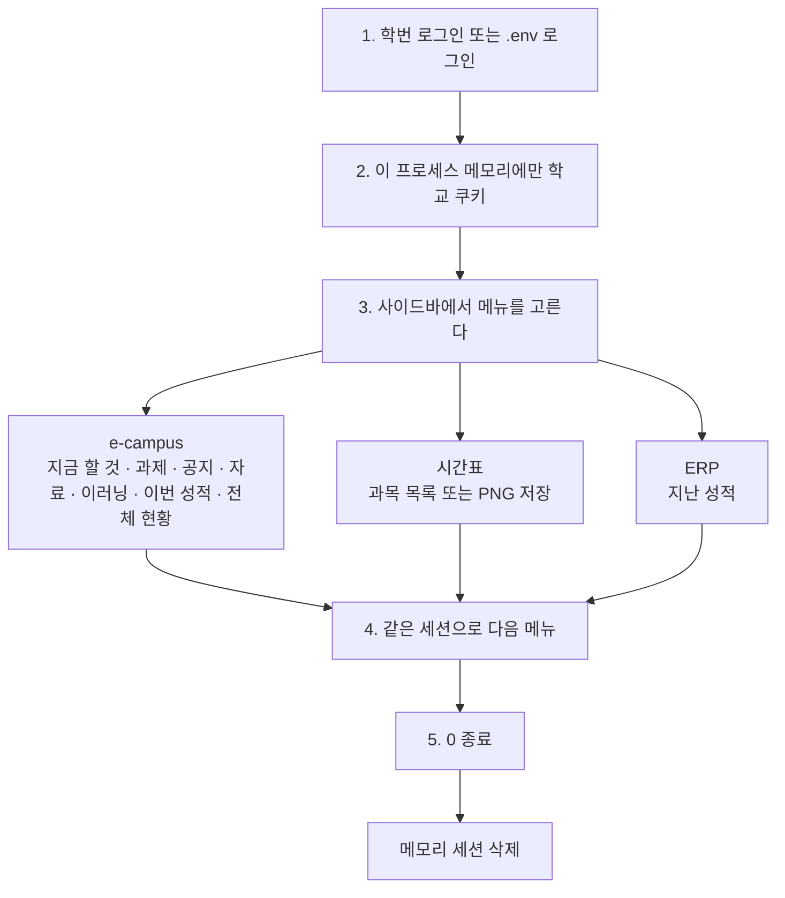
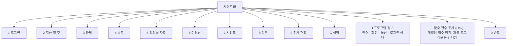
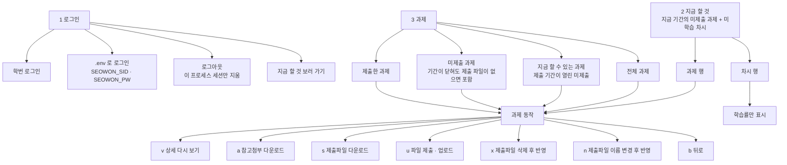
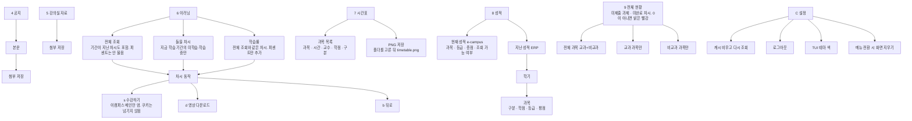

# 🎓 서원대 모아보기 · CLI

서원대학교 e-campus, 확정 수강 시간표, 통합정보시스템 ERP를 **한 대의 터미널**에서 보는 비공식 학생 CLI입니다.  
학교 연동은 `lib/back` 에 있고, 화면은 `lib/front/tui` 입니다. 웹 서버를 띄우지 않습니다. 이 프로세스가 학교 서버에 직접 접속합니다.

현재 버전은 `v1.0.0` 입니다.

> 서원대학교 공식 SDK가 아닙니다. 계정·세션·다운로드 파일은 공개 저장소에 올리지 마세요.

---

## 🧠 현재 구성

호스트와 쿠키는 서비스마다 다릅니다. 하나를 다른 자리에 넣지 않습니다.

| 구성 요소 | 위치 | 담당 역할 |
| :--- | :--- | :--- |
| e-campus LMS | `ecampus.seowon.ac.kr` · `EcampusClient` | 로그인, 과제·공지·자료·이러닝, 이번 학기 성적 |
| 확정 수강 시간표 | `sugangh.seowon.ac.kr` · `CourseRegistrationClient` | 확정 수강 목록으로 시간표 |
| 통합정보 ERP | `info.seowon.ac.kr` · `ErpClient` | 지난 학기 성적. 이번 학기 LMS 성적과 다름 |
| 조회 묶음 | `lib/back/campus.ts` | 로그인 세션 하나에서 메뉴가 부르는 함수 |
| 터미널 화면 | `lib/front/tui` | 메뉴, 표, 저장 폴더 선택 |

> **ERP ≠ e-campus 성적.** 지난 학기는 `info.seowon.ac.kr`, 이번 학기 강의실 성적은 `ecampus.seowon.ac.kr` 입니다.

---

## 🔁 요청이 지나가는 구조

```text
터미널
  학번 · 비밀번호
        │
        ▼
  lib/front/tui/cli.ts
        │
        ▼
  lib/back/campus.ts          메모리 세션 하나
        ├─ client.cookieJar      ecampus
        ├─ courseReg.cookieJar   시간표
        └─ erp.cookieJar         지난 성적
```

학번·비밀번호·학교 쿠키는 디스크에 쓰지 않습니다. 프로세스를 끝내면 그 세션은 사라집니다. 테마 색만 `data/tui-config.json` 에 남습니다.

추적 로그는 `fetchSnapshot({...})` 처럼 **부른 함수 이름**이고, 그 아래에는 `lib/back` 기준 service · engine 파일을 적습니다. HTTP 경로를 메뉴 로그로 찍지 않습니다.

---

## ✨ 핵심 기능

| 기능 | 설명 |
| :--- | :--- |
| 🔑 로그인 | 학번 입력 또는 `.env` 의 `SEOWON_SID` · `SEOWON_PW` |
| 🔥 지금 할 것 | 지금 제출 기간의 미제출 과제와, 지금 학습 기간의 미학습 차시 |
| 📝 과제 | 전체 · 지금 할 수 있는 과제 · 미제출 · 제출한 과제. 제출과 파일 삭제 |
| 📢 공지 · 📁 자료 | 과목별 본문과 첨부. 저장 위치를 고른 뒤 받는다 |
| 💻 이러닝 | 전체 조회는 기간이 지난 차시도 포함. 수강하기는 이캠퍼스 메인. 학습률은 과목별 진도 방식과 대체 방식을 사용해 이력 중 가장 높은 값을 읽음 |
| 🗓️ 시간표 | 과목과 시간. PNG 저장은 과목 선택과 별도 메뉴 |
| 📊 성적 | 이번 학기는 e-campus, 지난 학기는 ERP 등급·평점 |
| 📌 전체 현황 | 기간과 관계없는 미제출 과제, 기간 안 미완료 차시. 0이 아니면 밝은 빨강 |
| ⚙️ 설정 | 테마 색, 메뉴를 바꿀 때 화면 지우기, 캐시 비우기 |
| 🧪 함수 전수 조사 (Dev) | 개발용 함수 점검. 과제 제출과 로그아웃은 건너뜀 |

파일을 받을 때는 매번 폴더를 고릅니다. 그 폴더에서 `s` 를 누르면 저장하고, Esc 는 취소입니다. 첨부·영상·시간표 PNG 는 받는 동안 한 줄 진행 막대가 100%까지 찬 뒤 지워지고, 그 다음에 저장 결과가 나옵니다.

---

## 🧭 로그인부터 조회까지

학번 로그인 또는 `.env` 로그인이 끝나면 세션은 이 프로세스 메모리에만 남고, 아래 메뉴를 같은 세션으로 오갑니다. `2`~`9`, `C`, `T` 는 로그인이 있어야 열립니다. `1` 로그인, `I` 프로그램 정보, `0` 종료는 로그인 전에도 있습니다.



메뉴 구성은 다음과 같습니다.

```text
사이드바
├── 1  🔑 로그인
│     ├── 1  학번 로그인
│     ├── 2  .env 로 로그인          SEOWON_SID · SEOWON_PW
│     ├── 3  로그아웃                이 프로세스 세션만 지움
│     └── 4  지금 할 것 보러 가기
├── 2  🔥 지금 할 것                 지금 기간의 미제출 과제 + 미학습 차시
│     ├── 과제 행  →  과제 동작
│     └── 차시 행  →  학습률만 표시
├── 3  📝 과제
│     ├── 1  전체 과제
│     ├── 2  지금 할 수 있는 과제    제출 기간이 열린 미제출
│     ├── 3  미제출 과제             기간이 닫혀도 제출 파일이 없으면 포함
│     ├── 4  제출한 과제
│     └── 과제 동작
│           ├── v  상세 다시 보기
│           ├── a  참고첨부 다운로드
│           ├── s  제출파일 다운로드
│           ├── u  파일 제출 · 업로드
│           ├── x  제출파일 삭제 후 반영
│           ├── n  제출파일 이름 변경 후 반영
│           └── b  뒤로
├── 4  📢 공지                       목록 → 본문 → 첨부 저장
├── 5  📁 강의실 자료                목록 → 첨부 저장
├── 6  💻 이러닝
│     ├── 1  전체 조회               기간이 지난 차시도 포함. 퍼센트는 안 물음
│     ├── 2  들을 차시               지금 학습 기간의 미학습·학습중만
│     ├── 3  학습률                  전체 조회와 같은 차시. 퍼센트만 추가
│     └── 차시 동작
│           ├── s  수강하기          이캠퍼스 메인만 염. 쿠키는 넘기지 않음
│           ├── d  영상 다운로드
│           └── b  뒤로
├── 7  🗓️ 시간표
│     ├── 1  과목 목록               과목 · 시간 · 교수 · 학점 · 구분
│     └── 2  PNG 저장                폴더를 고른 뒤 timetable.png
├── 8  📊 성적
│     ├── 1  현재 성적 (e-campus)    과목 · 등급 · 총점 · 조회 가능 여부
│     └── 2  지난 성적 (ERP)         학기 → 과목(구분 · 학점 · 등급 · 평점)
├── 9  📌 전체 현황
│     ├── 1  전체 과목 (교과+비교과)
│     ├── 2  교과 과목만
│     └── 3  비교과 과목만           미제출 과제 · 미완료 차시. 0이 아니면 밝은 빨강
├── C  ⚙️ 설정
│     ├── 1  캐시 비우고 다시 조회
│     ├── 2  로그아웃
│     ├── 3  TUI 테마 색
│     └── 4  메뉴 전환 시 화면 지우기
├── I  🔬 프로그램 정보              언어 · 화면 · 통신 · 로그인 상태
├── T  🧪 함수 전수 조사 (Dev)       개발용 함수 점검. 제출·로그아웃은 건너뜀
└── 0  🚪 종료
```

사이드바는 그 세션 위에서 이렇게 갈라집니다.







파일을 받는 자리(참고첨부, 제출파일, 공지·자료 첨부, 영상, 시간표 PNG)는 모두 폴더를 고릅니다. 그 폴더에서 `s` 가 저장, Esc 가 취소입니다.

---

## 🖥️ 터미널 화면

키보드만 씁니다. 마우스로 메뉴를 고르지 않습니다.

| 조작 | 동작 |
| :--- | :--- |
| 숫자 · 단축키 | 사이드바 이동 |
| ↑↓ Enter | 목록에서 고르기 |
| `/` | 목록 검색 |
| Esc | 이전 화면. 메인에서 Esc 면 종료 |
| `q` | 종료 |
| 비밀번호 | 입력 중 `*` |
| 저장 | 폴더를 고른 뒤 `s` |

선택 줄은 배경을 끝까지 깔지 않습니다. 목록 칸은 그대로 그리고, 고른 줄의 글자만 테마 색으로 바꿉니다.

이러닝 **전체 조회**와 **학습률**은 같은 차시 범위이고, 지금 수강 기간이 아닌 차시도 포함합니다. 전체 조회는 수강하기·영상 받기이고, 학습률만 퍼센트를 묻습니다. 학습률은 그 과목 이러닝 목록의 학생 번호와 진도 방식으로 이력을 읽고, 표에 있는 값 중 가장 높은 퍼센트입니다. 목록 폼이나 특정 진도 방식이 실패해도 표준 진도 방식을 순서대로 재시도합니다. 이력이 없을 때만 0%입니다. **들을 차시**만 지금 학습 기간의 미학습·학습중입니다.

출결이 비어 있거나 이미 다 들은 경우에는 `차시 N건을 전부 수강하였습니다.`처럼 그 상황을 보여 줍니다. 수강하기는 브라우저에서 이캠퍼스 메인(`https://ecampus.seowon.ac.kr/home/mainHome/Form/main`)만 엽니다. 이 프로그램의 쿠키를 브라우저에 넣지 않습니다.

시간표 **과목 목록**은 시간만 보여 줍니다. **PNG 저장**을 따로 고르면 폴더를 지정해 그림을 받습니다. SVG·HTML 파일은 만들지 않습니다.

프로그램 정보는 TypeScript, Node.js 20, 자체 터미널 메뉴, axios, cheerio 를 적습니다. 화면용 웹 프레임워크는 쓰지 않습니다.

---

## 📁 파일 구조

```text
seowon-cli/
├── lib/
│   ├── back/                    학교 연동과 조회
│   │   ├── campus.ts            세션 하나. 메뉴가 부르는 함수
│   │   ├── filters.ts           기간 · 미제출 · 미학습 · 학습률 판별
│   │   ├── engine/              로그인 · 쿠키 · 원본 프로토콜
│   │   │   ├── ecampus/         과제 · 공지 · 자료 · 이러닝 · 이번 성적
│   │   │   ├── erp/             지난 성적
│   │   │   ├── course-registration/  확정 수강 · 시간표
│   │   │   └── hope-basket/     시간표 그림에 쓰는 공통 처리
│   │   ├── services/            화면이 쓰는 목록·제출·성적
│   │   └── types/
│   └── front/
│       └── tui/                 터미널 메뉴
│           ├── cli.ts           진입점
│           ├── tui-kit.ts       표 · 색 · 폴더 선택
│           └── tui-actions.ts   저장 · 제출 · 다운로드
├── scripts/copy-legacy.mjs      빌드 때 로그인 암호화 파일 복사
├── cli.bat
└── package.json
```

| 파일 | 담당 기능 |
| :--- | :--- |
| `lib/back/engine` | 학교와 직접 통신 |
| `lib/back/services` | 스냅샷 · 제출 · 성적 · 시간표 |
| `lib/back/campus.ts` | 메뉴가 부르는 함수. 웹 API가 아님 |
| `lib/front/tui/cli.ts` | 학생 메뉴 |
| `cli.bat` | Windows에서 설치 후 같은 메뉴 실행 |

모듈은 ESM (`"type": "module"`) 입니다. 언어는 TypeScript 이고 Node.js 20 에서 실행합니다. 화면은 웹 프레임워크 없이 `lib/front/tui` 가 그립니다. 학교 페이지는 axios, HTML 은 cheerio, 시간표 PNG 는 `@resvg/resvg-js` 입니다. 공개 함수는 한국어 JSDoc(`@param` / `@returns`)을 씁니다.

---

## ⚙️ 주요 설정

| 환경 변수 | 기본 | 설명 |
| :--- | :--- | :--- |
| `SEOWON_SID` | 없음 | 자동 로그인 학번. `.env` 에만 둔다 |
| `SEOWON_PW` | 없음 | 자동 로그인 비밀번호. `.env` 에만 둔다 |

`.env.example` 은 빈 칸만 있습니다. `.env`, `downloads/`, `data/`, `dist/` 는 저장소에 올리지 않습니다.

| 옵션 | 설명 |
| :--- | :--- |
| `--sid` `--pw` | 그 실행만 자동 로그인 |
| `--suite all` | 함수 전수 조사를 바로 실행 |
| `--depth <n>` | 상세·첨부 조사 건수. 기본 3 |
| `--heavy` | 상세를 전체 행까지. `--write` 와 함께 영상도 받음 |
| `--write` | 시간표와 첨부 하나를 저장. 폴더를 직접 고름 |
| `--timeout <ms>` | 함수 제한 시간. 기본 90000 |
| `--verbose` | 조회 결과 일부 출력 |
| `--list` | 조사하는 함수 이름과 하는 일 |
| `--help` | 도움말 |

---

## ▶️ 실행 방법

필요 환경은 Node.js 20 이상입니다. `seowon-client-web` 을 띄울 필요가 없습니다.

### 1. Windows에서 바로 켜기

```bat
cli.bat
```

`node_modules` 가 없으면 `npm install` 한 뒤 메뉴를 엽니다.

```bat
cli.bat --help
cli.bat --suite all --sid 학번 --pw 비밀번호
```

### 2. npm

```powershell
npm install
npm run api-cli
```

| 명령 | 하는 일 |
| :--- | :--- |
| `npm run api-cli` | `tsx` 로 `lib/front/tui/cli.ts` 실행 |
| `npm run dev` | 같은 진입점 |
| `npm run typecheck` | 타입만 검사 |
| `npm run build` | `tsc` 후 로그인 암호화 파일을 `dist` 로 복사 |
| `npm start` | `node dist/front/tui/cli.js` |

대화형 메뉴는 TTY 가 필요합니다. 조사가 끝나면 프로세스가 종료됩니다.

---

## ⚠️ 주의사항

- 다른 학생 계정은 조회하지 않습니다. 세션은 이 프로세스 메모리 하나입니다.
- `login.json`, 비밀번호 파일, 학교 쿠키 JSON 을 만들지 않습니다.
- 이러닝 시청 기록(`watchLesson`)은 보내지 않습니다. 수강하기는 이캠퍼스 메인만 엽니다.
- 함수 전수 조사 (Dev)는 과제를 제출하지 않고, 조사 끝에 로그아웃하지 않습니다.
- `--write` 와 메뉴의 저장은 고른 폴더에만 씁니다.

---

## ✅ 구현 현황

- ✅ 학교 서버 직접 접속. 웹 API 서버 없음
- ✅ e-campus 과제·공지·자료·이러닝·이번 학기 성적
- ✅ 미제출 과제는 기간이 닫혀 있어도 제출 파일이 없으면 미제출
- ✅ 확정 수강 시간표 PNG
- ✅ ERP 지난 성적 등급·평점
- ✅ 과제 제출과 제출 파일 삭제
- ✅ 저장할 때마다 폴더 선택
- ✅ 테마 색
- ✅ 조회 함수 전수 조사 (Dev). 함수가 하는 일과 service · engine 파일
- ✅ `.env` 학번·비밀번호 로그인
- ✅ 다운로드는 한 줄 진행 막대. 100% 뒤 그 줄은 지움
- ✅ 선택 줄은 글자색만 테마 색. 배경은 줄 끝까지 깔지 않음
- ✅ 학습률은 강의실의 학생 번호·진도 방식으로 조회

---

## 🧾 문서

문서는 기능 설명, 실행 방법, 주의사항, 문제 사례와 버그 수정 기록으로 나눠 관리합니다. 구현이 바뀌면 README의 메뉴·동작 설명과 `docs/` 사례 색인을 함께 갱신합니다.

- [문제 사례](./docs/README.md)
- [버그 수정 로그](./docs/BUGFIX_LOG.md)
- [엔진 폴더](./lib/back/engine/README.md)

## 관련 저장소

| 저장소 | 역할 |
| :--- | :--- |
| [seowon-cli](https://github.com/hy040504/seowon-cli) | 이 저장소. 한 대에서 조회·제출 |
| [seowon-client-web](https://github.com/hy040504/seowon-client-web) | 여러 학생이 브라우저로 보는 웹 |
| [seowon-client-api](https://github.com/hy040504/seowon-client-api) | 학교 연동 원본. 이 CLI 실행에는 필요 없음 |

---

MIT. 수업용 비공식 클라이언트입니다.
