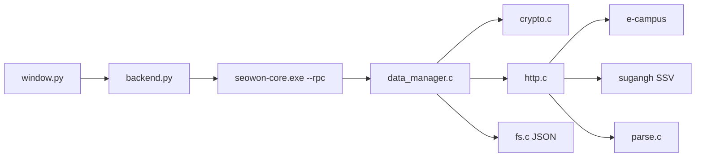

# seowon-cli

<p align="center">
  <strong>서원대학교 e-campus 과제 · 이러닝 현황을 창에서 한 번에 보는 PyQt 클라이언트</strong>
</p>

<p align="center">
  
  
  
  
  
  
</p>

한 번 로그인하면 과목마다 강의실을 열지 않고, **지금 할 과제**와 **들어야 할 이러닝**을 표로 봅니다.

공식 SDK가 아닙니다. **조회만** 합니다. 과제 제출, 이러닝 자동 시청, 수강신청은 넣지 않습니다.

이 브랜치(`gui`)는 **PyQt 화면만** 있습니다. 터미널 메뉴는 [`tui`](https://github.com/hy040504/seowon-cli/tree/tui), 둘 다는 [`main`](https://github.com/hy040504/seowon-cli/tree/main) 입니다.

```text
┌ 서원대 e-campus ─────────────┐
│ 조회 전용 · JSON 저장          │
│                              │
│ 로그인 / 세션                 │
│ 과제 확인                     │
│ 이러닝 확인                   │
│ 현황 한 표                    │
│ 파일 / 설정                   │
│                              │
│ 로그인됨: 홍길동 (20241234)    │
│           · 컴퓨터공학과       │
└──────────────────────────────┘
```

---

## 브랜치

| 브랜치 | 들어 있는 것 | 실행 파일 |
| --- | --- | --- |
| [`main`](https://github.com/hy040504/seowon-cli/tree/main) | TUI + GUI | `seowon-tui.exe`, `seowon-gui.exe` |
| [`tui`](https://github.com/hy040504/seowon-cli/tree/tui) | 터미널만. PyQt 없음 | `seowon-tui.exe` |
| [`gui`](https://github.com/hy040504/seowon-cli/tree/gui) | PyQt만. 터미널 메뉴 없음 | `seowon-gui.exe` + `seowon-core.exe` |

---

## 왜 쓰나

e-campus는 과목마다 강의실을 들어가야 과제·출결을 볼 수 있습니다.  
이 프로그램은 로그인 한 번으로 전 과목을 모아 **지금 할 일**만 보여 줍니다.

| 보고 싶은 것 | 화면 |
| --- | --- |
| 기간 안 미제출 과제 | 과제 확인 → 현재 수행 가능 |
| 미제출·진행중 전수 | 과제 확인 → 미제출 전수 |
| 들을 이러닝 차시 | 이러닝 확인 → 들을 차시 |
| 과목별 미제출 + 미완료 한 표 | 현황 한 표 |
| 고른 차시 학습률(%) | 이러닝 확인 → 학습률 |

학습률은 차시 목록에 없습니다. **고른 차시만** 한 번 더 조회합니다.  
비밀번호는 JSON에 넣지 않습니다.

---

## 화면

왼쪽 목록으로 이동합니다. TUI의 `switch` 메뉴와 같은 기능입니다.

```text
로그인 / 세션     학번·비밀번호, session.json 쿠키 재사용
과제 확인         전체 / 현재 수행 가능 / 미제출 전수 / 상세
이러닝 확인       차시 목록 · 들을 차시 · 학습률(%) — 조회만
현황 한 표        과목별 미제출 / 미완료
파일 / 설정       config.json, result.json 저장·불러오기
```

비밀번호 칸은 `*` 로 가립니다.

로그인에 성공하면 이름·학번·학과를 보여 줍니다. 예: `홍길동 (20241234) · 컴퓨터공학과`  
e-campus 로그인 JSON에는 이름·학과가 없어서, 수강신청 SSO(`sugangh`)에서 한 번 더 가져옵니다.

---

## 빠른 시작

### 필요 환경

| 항목 | 내용 |
| --- | --- |
| OS | Windows 10+ |
| 언어 | C11 (조회 백엔드) + Python 3 / PyQt6 (화면) |
| 편집기 | Visual Studio Code |
| 컴파일러 | MinGW-w64 / MSVC / TinyCC 중 하나 |
| 저장 | JSON만 (`config.json`, `session.json`, `result.json`) |
| 빌드 | `build.bat` 만. Makefile / CMake 없음 |

```bat
winget install BrechtSanders.WinLibs.POSIX.UCRT
pip install -r requirements.txt
```

### 빌드

이 폴더를 VS Code로 연 뒤 `Ctrl+Shift+B`, 또는:

```bat
build.bat
build.bat test
```

`build.bat` 은 `seowon-gui.exe`(창)와 `seowon-core.exe`(조회 `--rpc`)를 만듭니다.

### 실행

```bat
seowon-gui.exe              PyQt 창
seowon-gui.exe --demo       데모 체크로 시작
python lib\front\gui\main.py
seowon-core.exe --test      파서 · 암호 단위 테스트
seowon-core.exe --demo --rpc login
```

실제 로그인은 `seowon-core.exe`(조회 백엔드)가 있어야 합니다.

---

## 구조

저장소 루트가 작업 폴더입니다. `lib/front` · `lib/back` 배치는 [SeowonProject](https://github.com/hy040504/SeowonProject/tree/master/project) 를 따릅니다.

모듈은 `.h` / `.c` 한 쌍입니다. **`.h`는 다른 파일이 불러도 되는 API(함수·상수·자료형)**, **`.c`는 그 구현**입니다. 파일 안에서만 쓰는 함수는 `.c`에 `static` 으로 둡니다.

화면은 `lib/front/gui` (PyQt)입니다. 조회·로그인·JSON 은 `lib/back` + `seowon-core.exe --rpc` 입니다. 이 브랜치에는 터미널 메뉴(`prompt.c`)가 없습니다.

```text
seowon-cli
├─ gui_main.c             seowon-gui.exe
├─ main.c                 seowon-core.exe (--rpc)
├─ lib
│  ├─ front/gui           PyQt 화면
│  │  ├─ main.py
│  │  ├─ window.py
│  │  └─ backend.py
│  ├─ back                조회 · 파일 · 패킷
│  │  ├─ http / crypto / parse / fs
│  │  ├─ data_manager
│  │  └─ ssv / sugang     이름·학과 (수강신청 SSO)
│  ├─ c_modules           cJSON, winhttp_min
│  └─ util.c
├─ db/testdata            데모·테스트용 HTML/JSON (세션 파일 아님)
├─ requirements.txt
├─ build.bat
└─ README.md
```



---

## 저장 파일

`config.json` 은 실행 폴더, 세션·결과는 `dataDir`(기본 `./db`) 아래입니다.  
`./db` 가 없으면 실행할 때 만듭니다.  
저장소에는 **`db/testdata`만** 올립니다. `session.json` / `result.json` / `config.json` 은 `.gitignore` 입니다.

예제: [`config.json.example`](config.json.example)

```json
{
  "lastStudentId": "20241234",
  "saveSession": true,
  "saveResult": true,
  "dataDir": "./db"
}
```

| 파일 | 내용 |
| --- | --- |
| `config.json` | 마지막 학번, 저장 옵션, 폴더 |
| `db/session.json` | 학번, 이름, 학과, 쿠키. **비밀번호 없음** |
| `db/result.json` | 최근 조회 결과. 오프라인에서 다시 그림 |
| `db/testdata/` | 데모·단위 테스트용 고정 응답 |

`session.json` 필드:

```json
{
  "studentId": "20241234",
  "userNo": "20241234",
  "studentName": "홍길동",
  "deptName": "컴퓨터공학과",
  "deptCd": "320",
  "savedAt": "2026-08-16T12:00:00",
  "cookies": []
}
```

---

## 요청 흐름

[seowon-client-api](https://github.com/hy040504/seowon-client-api) 와 같은 조회 경로입니다.

1. `GET /home/mainPop/popup/login` — 세션 쿠키
2. NICE `encryptData` 를 `POST /user/userHome/login`
3. 이름·학과: `sugangh.seowon.ac.kr` 의 `findAppcsLogin` / `findStunoInfo` (SSV)
4. `POST /crs/creCrsHome/classRoomCrsCreList` — 과목
5. `POST /asmnt/asmntHome/stuAsmntGridList` — 과제
6. `POST /lesson/lessonLect/lessonList` — 이러닝 차시
7. (선택) `POST /asmnt/asmntLect/Form/asmntStuMain` — 과제 상세
8. (선택) `POST /lesson/lessonLect/viewLessonStudyDetail` — 학습률. **기록 전송 없음**

HTTP는 Windows **WinHTTP**, JSON은 `lib/c_modules` 의 [cJSON](https://github.com/DaveGamble/cJSON) 입니다.

## 외부 라이브러리 (`lib/c_modules`)

직접 짠 코드가 아니라 가져다 쓰는 소스입니다. `front` / `back` 과 구분해 둡니다.

| 파일 | 역할 |
| --- | --- |
| `cJSON.c` / `cJSON.h` | `config.json`, `session.json`, `result.json`, 로그인 JSON |
| `cJSON.LICENSE` | cJSON MIT 라이선스 |
| `winhttp_min.h` | TinyCC처럼 SDK `winhttp.h` 가 없을 때 쓰는 선언. 본체는 `winhttp.dll` |

---

## 하지 않는 것

- 과제 제출, 파일 업로드
- 이러닝 자동 시청 · 출석 처리
- 수강신청 · 희망바구니
- 다른 학생 계정 조회
- `.dat` / `.txt` / SQLite
- 비밀번호를 JSON에 저장

---

## 변경 사항

코드에 이미 들어가 있는 내용을 README에 한곳에 모아 둡니다.

### 브랜치 나누기

- `main` — TUI와 GUI를 모두 둠.
- `tui` — 터미널만. PyQt 없음.
- `gui` — 이 브랜치. PyQt만. 터미널 메뉴(`prompt.c`) 없음. 조회는 `seowon-core.exe --rpc`.

### 화면 · 입력

- [SeowonProject](https://github.com/hy040504/SeowonProject) 처럼 `lib/front` · `lib/back` 으로 나누고, 주석은 한국어, 파일 안 함수는 `static`.
- 왼쪽 목록이 TUI `switch` 메뉴와 같은 기능을 함.
- 기능표 번호(`1.1.1`, `1.1.2` …)를 화면 글에서 뺌.
- 비밀번호 칸은 `*` 로 가림.

### 로그인 후 이름 · 학번 · 학과

- e-campus 로그인만으로는 이름·학과가 안 나와서 `sugangh` SSO SSV(`findAppcsLogin`, `findStunoInfo`)를 씀.
- 상태 줄에 `이름 (학번) · 학과` 를 표시.
- `session.json` 에 `studentName`, `deptName`, `deptCd` 를 같이 저장. 비밀번호는 저장하지 않음.

### 저장소 · 빌드

- 예전 `project/` 안 파일을 저장소 루트로 옮김.
- 외부 라이브러리 폴더 이름: `lib/vendor` → `lib/c_modules`.
- `Makefile`, `CMakeLists.txt` 를 지움. 빌드는 `build.bat` 만.
- `./db` 는 실행 때 없으면 만듦. Git에는 `db/testdata` 만 두고, 실제 `session.json` / `result.json` 은 올리지 않음.

### GUI

- `lib/front/gui` 에 PyQt6 화면. `seowon-gui.exe` 가 `main.py` 를 띄움.
- 조회는 `seowon-core.exe --rpc`.

---

## 라이선스

MIT. 수업용 **비공식** 클라이언트입니다.  
cJSON 은 MIT 라이선스입니다.
