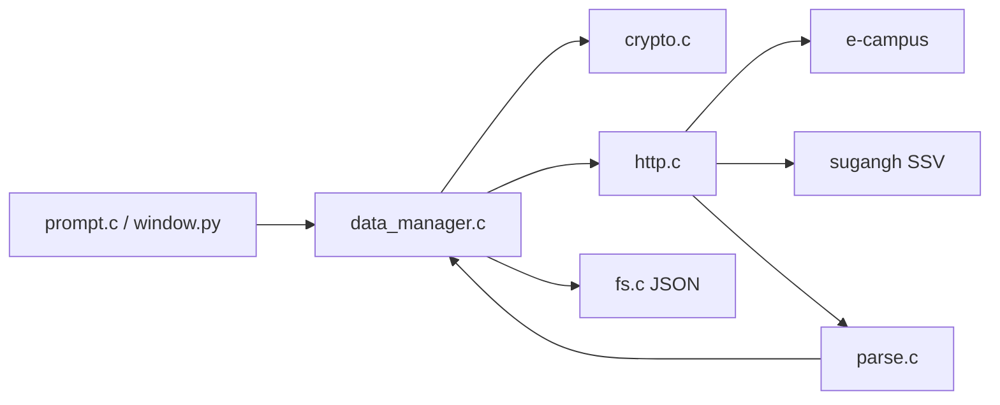

# seowon-cli

<p align="center">
  <strong>서원대학교 e-campus 과제 · 이러닝 현황을 터미널과 창에서 한 번에 보는 C 클라이언트</strong>
</p>

<p align="center">
  
  
  
  
  
</p>

한 번 로그인하면 과목마다 강의실을 열지 않고, **지금 할 과제**와 **들어야 할 이러닝**을 표로 봅니다.

공식 SDK가 아닙니다. **조회만** 합니다. 과제 제출, 이러닝 자동 시청, 수강신청은 넣지 않습니다.

저장소: [hy040504/seowon-cli](https://github.com/hy040504/seowon-cli)

```text
============================================
  서원대 e-campus 과제·이러닝 현황   v1.0.0
  조회 전용 · C언어 · JSON 저장
============================================
[100.0%] Loading... *

  메인 메뉴
  [로그인됨: 홍길동 (20241234) · 컴퓨터공학과]
  1. 로그인 / 세션
  2. 과제 확인
  3. 이러닝 확인
  4. 현황 한 표 요약
  5. 파일 / 설정
  0. 종료
```

---

## 브랜치

| 브랜치 | 들어 있는 것 | 실행 파일 |
| --- | --- | --- |
| [`main`](https://github.com/hy040504/seowon-cli/tree/main) | TUI + GUI | `seowon-tui.exe`, `seowon-gui.exe` |
| [`tui`](https://github.com/hy040504/seowon-cli/tree/tui) | 터미널만. PyQt 없음 | `seowon-tui.exe` |
| [`gui`](https://github.com/hy040504/seowon-cli/tree/gui) | PyQt만. 터미널 메뉴 없음 | `seowon-gui.exe` (조회는 `seowon-tui.exe --rpc`) |

---

## 왜 쓰나

e-campus는 과목마다 강의실을 들어가야 과제·출결을 볼 수 있습니다.  
이 프로그램은 로그인 한 번으로 전 과목을 모아 **지금 할 일**만 보여 줍니다.

| 보고 싶은 것 | 메뉴 |
| --- | --- |
| 기간 안 미제출 과제 | `2` → `2` |
| 미제출·진행중 전수 | `2` → `3` |
| 들을 이러닝 차시 | `3` → `2` |
| 과목별 미제출 + 미완료 한 표 | `4` |
| 고른 차시 학습률(%) | `3` → `3` |

학습률은 차시 목록에 없습니다. **고른 차시만** 한 번 더 조회합니다.  
학번·비밀번호는 `login.json` 에 둘 다 채워 두면 입력을 건너뜁니다. 하나라도 비어 있으면 예전처럼 직접 입력합니다. `session.json` / `result.json` / `config.json` 에는 비밀번호를 넣지 않습니다.

---

## 메뉴

`switch` 계층 메뉴입니다. `z` / `0` 은 뒤로, `q` 는 종료입니다.  
기능표 번호(`1.1.1` 같은 것)는 메뉴에 적지 않습니다.

```text
메인
├─ 1  로그인 / 세션          login.json 또는 직접 입력, session.json 쿠키 재사용
├─ 2  과제 확인
│   ├─ 1  전체 과제
│   ├─ 2  현재 수행 가능 (기간 안 + 미제출)
│   ├─ 3  미제출 전수 조사
│   └─ 4  과제 상세
├─ 3  이러닝 확인
│   ├─ 1  차시 목록 · 출결
│   ├─ 2  들을 차시
│   └─ 3  학습률(%) — 조회만, 시청 기록 없음
├─ 4  현황 한 표             과목별 미제출 / 미완료
└─ 5  파일 / 설정
    ├─ 1  config.json · login.json 상태
    ├─ 2  result.json 저장
    └─ 3  result.json 불러오기
```

시작 화면과 메뉴 전환에는 [SeowonProject](https://github.com/hy040504/SeowonProject) 의 `LoadSpin` 을 응용한 로딩 효과가 있습니다.

비밀번호는 `*` 로 가리고, **마지막으로 친 글자만** 잠깐 보입니다.

로그인에 성공하면 이름·학번·학과를 보여 줍니다. 예: `홍길동 (20241234) · 컴퓨터공학과`  
e-campus 로그인 JSON에는 이름·학과가 없어서, 수강신청 SSO(`sugangh`)에서 한 번 더 가져옵니다.

---

## 빠른 시작

### 필요 환경

| 항목 | 내용 |
| --- | --- |
| OS | Windows 10+ |
| 언어 | C11 |
| 편집기 | Visual Studio Code |
| 컴파일러 | MinGW-w64 / MSVC / TinyCC 중 하나 |
| 저장 | JSON만 (`config.json`, `login.json`, `session.json`, `result.json`) |
| 빌드 | `build.bat` 만. Makefile / CMake 없음 |

```bat
winget install BrechtSanders.WinLibs.POSIX.UCRT
```

### 빌드

이 폴더를 VS Code로 연 뒤 `Ctrl+Shift+B`, 또는:

```bat
build.bat              TUI 실행 파일 (seowon-tui.exe)
build.bat gui          GUI 실행 파일 (seowon-gui.exe)
build.bat all          둘 다
build.bat test         TUI 단위 테스트
```

GUI 는 Python 3 + PyQt6 가 필요합니다.

```bat
pip install -r requirements.txt
```

### 실행

```bat
seowon-tui.exe              터미널 메뉴 (실제 e-campus)
seowon-tui.exe --demo       testdata 로 오프라인 시연
seowon-tui.exe --test       파서 · 필터 · 암호 단위 테스트
seowon-gui.exe              PyQt 창
seowon-gui.exe --demo       GUI 를 데모 체크로 시작
python lib\front\gui\main.py
```

실행 파일은 **`seowon-tui.exe`** 와 **`seowon-gui.exe`** 만 쓴다.  
데모는 네트워크 없이 메뉴와 표를 보여 줄 때 씁니다.  
실제 로그인을 GUI 에서 쓰려면 먼저 `build.bat`(TUI) 가 되어 있어야 합니다.  
GUI 는 `seowon-tui.exe --rpc` 를 **콘솔 창 없이** 백그라운드에서 부릅니다.

---

## 구조

저장소 루트가 작업 폴더입니다. `lib/front` · `lib/back` 배치는 [SeowonProject](https://github.com/hy040504/SeowonProject/tree/master/project) 를 따릅니다.

모듈은 `.h` / `.c` 한 쌍입니다. **`.h`는 다른 파일이 불러도 되는 API(함수·상수·자료형)**, **`.c`는 그 구현**입니다. 파일 안에서만 쓰는 함수는 `.c`에 `static` 으로 둡니다.

화면은 `lib/front/tui`(C 터미널)와 `lib/front/gui`(PyQt)로 나뉩니다. 조회·로그인·JSON 은 `lib/back` 을 같이 씁니다. GUI 는 `seowon-tui.exe --rpc` 를 콘솔 창 없이 부릅니다.

```text
seowon-cli
├─ main.c                 TUI 진입점
├─ gui_main.c             GUI 실행 파일 (python 으로 main.py 실행)
├─ test.c
├─ lib
│  ├─ front
│  │  ├─ tui              C 터미널 UI
│  │  │  ├─ ui.c / ui.h
│  │  │  └─ prompt.c / prompt.h
│  │  └─ gui              PyQt 화면
│  │     ├─ main.py
│  │     ├─ window.py
│  │     ├─ style.py
│  │     ├─ widgets.py
│  │     └─ backend.py
│  ├─ back                조회 · 파일 · 패킷
│  │  ├─ http / crypto / parse / fs
│  │  ├─ data_manager
│  │  └─ ssv / sugang     이름·학과 (수강신청 SSO)
│  ├─ c_modules           외부 라이브러리 (cJSON, winhttp_min)
│  ├─ seowon.h
│  └─ util.c
├─ db/testdata            데모·테스트용 HTML/JSON (세션 파일 아님)
├─ login.json.example     학번·비밀번호 빈 칸 예제
├─ requirements.txt       PyQt6
├─ build.bat
└─ README.md
```



---

## 저장 파일

`config.json` · `login.json` 은 실행 폴더, 세션·결과는 `dataDir`(기본 `./db`) 아래입니다.  
`./db` 가 없으면 실행할 때 만듭니다.  
저장소에는 **`db/testdata`만** 올립니다. `session.json` / `result.json` / `config.json` / `login.json` 은 `.gitignore` 입니다.

예제: [`config.json.example`](config.json.example), [`login.json.example`](login.json.example)

```json
{
  "lastStudentId": "20241234",
  "saveSession": true,
  "saveResult": true,
  "dataDir": "./db"
}
```

| 파일 | 내용 |
| --- | --- |
| `config.json` | 마지막 학번, 저장 옵션, 폴더 |
| `login.json` | 학번·비밀번호. 둘 다 있으면 로그인 입력 생략. **로컬 평문, git 제외** |
| `db/session.json` | 학번, 이름, 학과, 쿠키. **비밀번호 없음** |
| `db/result.json` | 최근 조회 결과. 오프라인에서 다시 그림 |
| `db/testdata/` | 데모·단위 테스트용 고정 응답 |

`login.json` 예제:

```json
{
  "studentId": "",
  "password": ""
}
```

학번이나 비밀번호 중 하나라도 비어 있으면 TUI·GUI 모두 지금처럼 직접 입력합니다.

`session.json` 필드:

```json
{
  "studentId": "20241234",
  "userNo": "20241234",
  "studentName": "홍길동",
  "deptName": "컴퓨터공학과",
  "deptCd": "320",
  "savedAt": "2026-08-16T12:00:00",
  "cookies": []
}
```

---

## 요청 흐름

[seowon-client-api](https://github.com/hy040504/seowon-client-api) 와 같은 조회 경로입니다.

1. `GET /home/mainPop/popup/login` — 세션 쿠키
2. NICE `encryptData` 를 `POST /user/userHome/login`
3. 이름·학과: `sugangh.seowon.ac.kr` 의 `findAppcsLogin` / `findStunoInfo` (SSV)
4. `POST /crs/creCrsHome/classRoomCrsCreList` — 과목
5. `POST /asmnt/asmntHome/stuAsmntGridList` — 과제
6. `POST /lesson/lessonLect/lessonList` — 이러닝 차시
7. (선택) `POST /asmnt/asmntLect/Form/asmntStuMain` — 과제 상세
8. (선택) `POST /lesson/lessonLect/viewLessonStudyDetail` — 학습률. **기록 전송 없음**

HTTP는 Windows **WinHTTP**, JSON은 `lib/c_modules` 의 [cJSON](https://github.com/DaveGamble/cJSON) 입니다.

## 외부 라이브러리 (`lib/c_modules`)

직접 짠 코드가 아니라 가져다 쓰는 소스입니다. `front` / `back` 과 구분해 둡니다.

| 파일 | 역할 |
| --- | --- |
| `cJSON.c` / `cJSON.h` | `config.json`, `login.json`, `session.json`, `result.json`, 로그인 응답 JSON |
| `cJSON.LICENSE` | cJSON MIT 라이선스 |
| `winhttp_min.h` | TinyCC처럼 SDK `winhttp.h` 가 없을 때 쓰는 선언. 본체는 `winhttp.dll` |

---

## 하지 않는 것

- 과제 제출, 파일 업로드
- 이러닝 자동 시청 · 출석 처리
- 수강신청 · 희망바구니
- 다른 학생 계정 조회
- `.dat` / `.txt` / SQLite
- `session.json` · `result.json` · `config.json` 에 비밀번호 저장
- `login.json` 을 Git·원격에 올리기 (로컬 전용)

---

## 변경 사항

코드에 이미 들어가 있는 내용을 README에 한곳에 모아 둡니다.

### 브랜치 나누기

- `main` — TUI와 GUI를 모두 둠.
- `tui` — 터미널만. `lib/front/gui`, `gui_main.c`, `requirements.txt` 없음.
- `gui` — PyQt만. 터미널 메뉴(`prompt.c`) 없음. 조회는 `seowon-tui.exe --rpc`.

### 화면 · 입력

- [SeowonProject](https://github.com/hy040504/SeowonProject) 처럼 `lib/front` · `lib/back` 으로 나누고, 주석은 한국어, 파일 안 함수는 `static`.
- 메뉴를 `switch` 계층으로 바꿈. `z`/`0` 뒤로, `q` 종료.
- 기능표 번호(`1.1.1`, `1.1.2` …)를 메뉴 글에서 뺌.
- 비밀번호는 `*` 로 가리고, 마지막 글자만 잠깐 보여 줌.

### 로그인 후 이름 · 학번 · 학과

- e-campus 로그인만으로는 이름·학과가 안 나와서 `sugangh` SSO SSV(`findAppcsLogin`, `findStunoInfo`)를 씀.
- TUI·GUI 로그인 줄에 `이름 (학번) · 학과` 를 표시.
- `session.json` 에 `studentName`, `deptName`, `deptCd` 를 같이 저장. 비밀번호는 `session.json` 에 넣지 않음.
- 로그인 계정은 `login.json`. 학번·비밀번호가 둘 다 있으면 입력을 건너뛰고, 하나라도 비면 직접 입력.

### 저장소 · 빌드

- 예전 `project/` 안 파일을 저장소 루트로 옮김.
- 외부 라이브러리 폴더 이름: `lib/vendor` → `lib/c_modules`.
- `Makefile`, `CMakeLists.txt` 를 지움. 빌드는 `build.bat` 만.
- `./db` 는 실행 때 없으면 만듦. Git에는 `db/testdata` 만 두고, 실제 `session.json` / `result.json` / `login.json` 은 올리지 않음.

### GUI

- `lib/front/gui` 에 PyQt6 화면. `seowon-gui.exe` 가 `main.py` 를 띄움.
- 화면은 토스뱅크에 가까운 카드 UI. 설정에서 라이트/다크를 켠다. 다크는 어두운 바탕과 밝은 글자.
- 로그인에 성공하면 알림창 대신 Successful! 카드로 바뀐다.
- 데모 모드 칸은 파란 네모 안 V자 체크.
- 로그인·조회 중에는 스피너 오버레이. `seowon-tui.exe --rpc` 는 콘솔 창 없이 백그라운드에서 돈다.
- 실행 파일은 `seowon-tui.exe` 와 `seowon-gui.exe` 만 쓴다.
- 로그인 칸은 `login.json` 을 미리 채움. 학번·비밀번호가 둘 다 있으면 입력 없이 로그인할 수 있음.

---

## 라이선스

MIT. 수업용 **비공식** 클라이언트입니다.  
cJSON 은 MIT 라이선스입니다.
